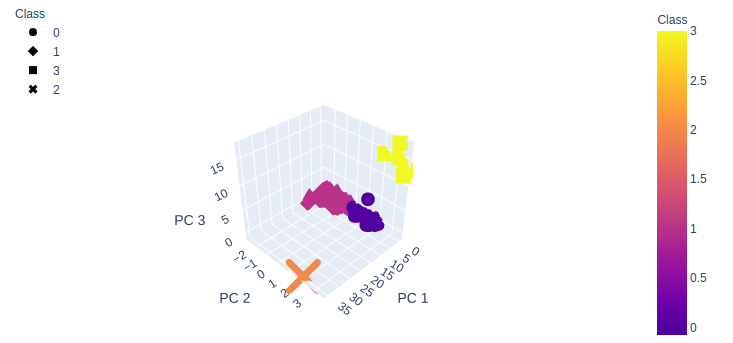

# Cryptocurrencies


# Overview
          


# Resources
* Data Sources: crypto_data.csv
* Software: Jupyter Notebook, Python 3.7, Pandas

# GitHub Application Link

<a href="https://jillibus.github.io/Cryptocurrencies">Cryptocurrencies</a>

## Deliverable 1: Preprocessing the Data for PCA

Data preprocessing involves transforming raw data to well-formed data sets so that data mining analytics can be applied. Raw data is often incomplete and has inconsistent formatting. The adequacy or inadequacy of data preparation has a direct correlation with the success of any project that involve data analyics.

Preprocessing involves both data validation and data imputation. The goal of data validation is to assess whether the data in question is both complete and accurate. The goal of data imputation is to correct errors and input missing values -- either manually or automatically through business process automation (BPA) programming.

Data preprocessing is used in both database-driven and rules-based applications. In machine learning (ML) processes, data preprocessing is critical for ensuring large datasets are formatted in such a way that the data they contain can be interpreted and parsed by learning algorithms. (https://www.techopedia.com/definition/14650/data-preprocessing)

In our project we performed _Data Preprocessing_ by perfomring the following steps:
*  In the **crypto_df** 
    *  All cryptocurrencies that are not being traded are removed.
    *  The IsTrading column is dropped
    *  All the rows that have at least one null value are removed.
    *  All the rows that do not have coins being mined are removed.
    *  The CoinName column is dropped.
* A new DataFrame, **cryptonames_df**, is created that stores all cryptocurrency names from the CoinName column and retains the index from the crypto_df DataFrame.
* The get_dummies() method is used to create variables for the text features, which are then stored in a new DataFrame, X.
* The features from the X DataFrame have been standardized using the StandardScaler fit_transform() function.

```
# Keep the rows where coins are mined.
crypto_df.drop(crypto_df[crypto_df.TotalCoinsMined <= 0].index, inplace=True)
print(crypto_df.shape)
crypto_df.head(10)
```


___
```
# Create a new DataFrame that holds only the cryptocurrencies names.
cryptonames_df = crypto_df[['CoinName']]
print(crypto_df.shape)
cryptonames_df.head()
```


---
```
# Use get_dummies() to create variables for text features.
X = pd.get_dummies(crypto_df, columns=['Algorithm', 'ProofType'])
print(X.shape)
X.head()
```


---
```
# Standardize the data with StandardScaler().
scaler = StandardScaler()

crypto_scaled = scaler.fit_transform(X)
print(crypto_scaled[0:5])
```

## For Deliverable 2: Reducing Data Dimensions Using PCA
Using the Principal Component Analysis (PCA) Algorithm, I will reduce the dimensions of the X DataFrame to 3 principal components and place these dimensions into a new DataFrame.

In our project we created a new DataFrame **pcs_df** that added new columns, _PC 1_, _PC 2_, _PC 3_, and used the index of **crypto_df** DataFrame as the index.
```
# Using PCA to reduce dimension to three principal components.
pca = PCA(n_components=3)

# Create a DataFrame with the three principal components.
crypto_pca = pca.fit_transform(crypto_scaled)

pcs_df = pd.DataFrame(
    data=crypto_pca, columns=['PC 1', 'PC 2', 'PC 3'], index=crypto_df.index)

pcs_df.head(10)
```


## For Deliverable 3: Clustering Cryptocurrencies Using K-means
Using the K-means algorithm:

* Create an _Elbow Curve_ using the _hvPlot_ to find the best value for _K_ from the **pcs_df** DataFrame.  
* Once that is found, use the K-means algorithm and then use the _K_ value found to predict the number of _K_ clusters for the cryptocurrencies' data. 
* Create a new DataFrame, **clustered_df**, which concatenates the **crypto_df** with the **pcs_df**, the index will be the same as the **crypto_df**.
* Add the CoinName column from the **cryptonames_df** to the **clustered_df**.
* Add a new column, **clustered_df['Class']** which holds the predictions (model.labels_)

```
inertia = []
k = list(range(1, 11))

# Calculate the inertia for the range of k values
for i in k:
    km = KMeans(n_clusters=i, random_state=0)
    km.fit(pcs_df)
    inertia.append(km.inertia_)

# Create the Elbow Curve using hvPlot
elbow_data = {"k": k, "inertia": inertia}
df_elbow = pd.DataFrame(elbow_data)
df_elbow.hvplot.line(x="k", y="inertia", xticks=k, title="Elbow Curve")
```


---
```
# Initialize the K-Means model
model = KMeans(n_clusters=4, random_state=0)

# Fit the model
model.fit(pcs_df)

# Predict clusters
predictions = model.predict(pcs_df)
predictions
```


---
```
# Add the predicted class columns
pcs_df["Class"] = model.labels_
pcs_df.head()
```


---
```
# Create a new DataFrame including predicted clusters and cryptocurrencies features.
# Concatentate the crypto_df and pcs_df DataFrames on the same columns.
clustered_df = crypto_df.join(pcs_df)

#  Add a new column, "CoinName" to the clustered_df DataFrame that holds the names of the cryptocurrencies. 
clustered_df['CoinName'] = cryptonames_df['CoinName']

#  Add a new column, "Class" to the clustered_df DataFrame that holds the predictions.
clustered_df['Class'] = model.labels_

# Print the shape of the clustered_df
print(clustered_df.shape)
clustered_df.head(10)
```


## For Deliverable 4: Visualizing Cryptocurrencies Result
For this deliverable, I will demonstrate, visually, using scatter plots, the distinct groups that correspond to the 3 principal components (PC 1, PC 2, PC 3) as well as a table with all of the currently tradable cryptocurrencies using the _hvplot.table()_ function.

* Creating 3D Scatter Plot with Clusters
* Create a table with tradable cryptocurrencies using _hvplot.table()_
* The total number of tradable cryptocurrencies is printed.
* A DataFrame, **plot_df** is created that contains the **clustered_df** DataFrame index, the scaled data, and the CoinName and Class columns
* A hvplot scatter plot, with the X-axis = 'TotalCoinsMined' and Y-axis = 'TotalCoinSupply' and the data is ordered by 'Class'

```
fig = px.scatter_3d(
    clustered_df,
    x="PC 1",
    y="PC 2",
    z="PC 3",
    color="Class",
    symbol="Class",
    width=800,
    hover_name="CoinName",
    hover_data=["Algorithm"]
)
fig.update_layout(legend=dict(x=0, y=1))
fig.show()
```


---
```
# Create a table with tradable cryptocurrencies.
clustered_df.hvplot.table(columns=['CoinName','Algorithm','ProofType','TotalCoinSupply','TotalCoinsMined','Class']
                         )
```


---
```
# Print the total number of tradable cryptocurrencies
print(f'There are {len(clustered_df)} tradable cryptocurrencies.')

There are 577 tradable cryptocurrencies.
```
---


# Summary


Thank you for your time and let me know if you wish to see any additional data.

Jill Hughes
